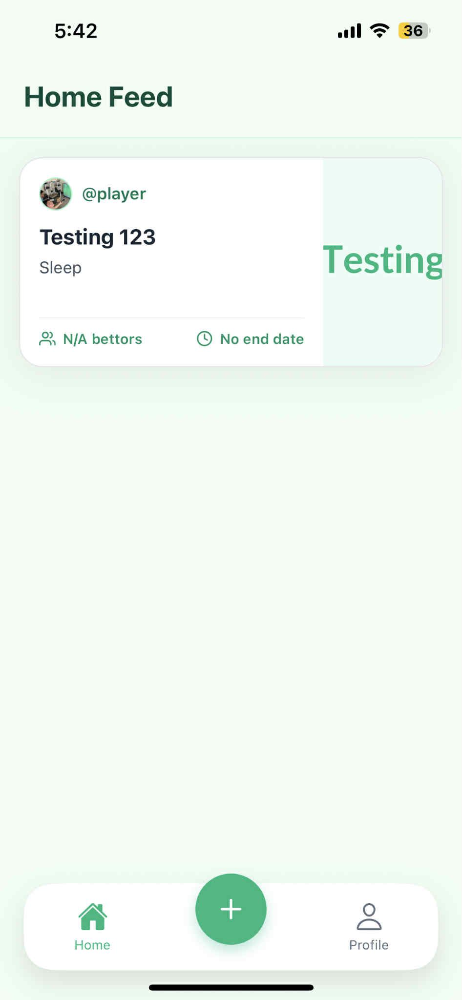
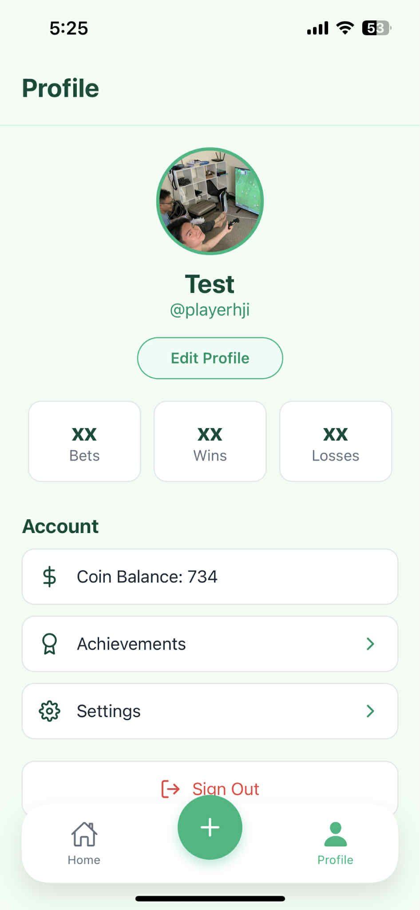
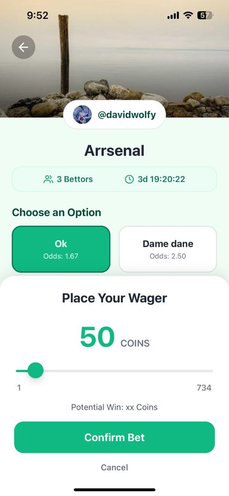

# StakeUp

<div align="center">
  
  
</div>

<div align="center" style="font-size: 32px;">

<h3>Friendly Wagers, Real Fun.</h3>

</div>

---

## About The Project

StakeUp is a mobile app designed to make friendly challenges between friends simple, engaging, and memorable. Whether you're competing in fitness goals (Who do more pushups this week?), game predictions (Will Arsenal win the UEFA Champions League?), or just simple stuff (Who won more League of Legends games?), StakeUp helps you initiate, track, and settle outcomes, ensuring no one forgets what’s at stake.

This repository contains the complete source code for both the mobile frontend and the backend server.

---

## Screenshots

<div align="center">
  
  
  
</div>

---

## Tech Stack

StakeUp is organized as a monorepo with both the client and server in one repository.

### Frontend

*   **Framework:** [React Native](https://reactnative.dev/) with [Expo](https://expo.dev/)
*   **Language:** [TypeScript](https://www.typescriptlang.org/)
*   **Navigation:** [React Navigation](https://reactnavigation.org/) & [Expo Router](https://expo.github.io/router/)
*   **State Management:** [Zustand](https://github.com/pmndrs/zustand)
*   **Backend Communication:** [Axios](https://axios-http.com/) & [Supabase Client](https://supabase.com/docs/library/js/getting-started)

### Backend

*   **Framework:** [Express.js](https://expressjs.com/)
*   **Language:** [TypeScript](https://www.typescriptlang.org/)
*   **Database & Auth:** [Supabase](https://supabase.com/)
*   **Runtime:** [Node.js](https://nodejs.org/)
*   **Scheduled Jobs:** [node-cron](https://github.com/node-cron/node-cron)

---

## Upcoming features

[ ] User Bet History

[ ] HOMESCREEN: Implement pagination (scroll like Facebook) to efficiently load bets on the home screen.

[ ] HOMESCREEN: Add UI controls to filter and sort the main feed by "Active," "Ending Soon," and "Settled."

[ ] Integrate Expo Push Notifications

[ ] Private Bets: Allow users to create invite-only bets for specific groups of friends.

[ ] Achievements & Badges: Reward users with badges for milestones (e.g., "First Win," "High Roller," "Prophet").

[ ] End-to-End Testing: Implement a comprehensive testing suite with Detox.

[ ] CI/CD Pipeline: Automate testing and deployment processes using GitHub Actions.

---

## Getting Started

To get a local copy up and running, follow these simple steps.

### Prerequisites

*   Node.js (v18 or newer recommended)
*   npm or yarn
*   A [Supabase](https://supabase.com/) account for the database and authentication.

### Installation

1.  **Clone the repo**
    ```sh
    git clone https://github.com/your_username/StakeUp.git
    cd StakeUp
    ```

2.  **Set up the Backend**

    *   Navigate to the backend directory
        ```sh
        cd backend
        ```
    *   Install NPM packages
        ```sh
        npm install
        ```
    *   Create a `.env` file in the `backend` directory by copying the example file.
        ```sh
        cp .env.example .env
        ```
    *   Add your Supabase project URL, Anon Key, and a JWT secret to the `.env` file.
        ```dotenv
        SUPABASE_URL=your_supabase_url
        SUPABASE_KEY=your_supabase_anon_key
        JWT_SECRET=your_super_secret_jwt_key
        ```
    *   Start the backend server.
        ```sh
        npm run dev
        ```
        The server will start on `http://localhost:3000` (or your configured port).

3.  **Set up the Frontend**

    *   Navigate to the frontend directory from the root.
        ```sh
        cd ../frontend
        ```
    *   Install NPM packages
        ```sh
        npm install
        ```
    *   Start the Expo development server.
        ```sh
        npx expo start
        ```
    *   Follow the instructions in the terminal to run the app on an iOS simulator, Android emulator, or on your physical device using the Expo Go app.

---

## Contributing

Contributions are what make the open-source community such an amazing place to learn, inspire, and create. Any contributions you make are **greatly appreciated**.

If you have a suggestion that would make this better, please fork the repo and create a pull request. You can also simply open an issue with the tag "enhancement".

1.  Fork the Project
2.  Create your Feature Branch (`git checkout -b feature/AmazingFeature`)
3.  Commit your Changes (`git commit -m 'Add some AmazingFeature'`)
4.  Push to the Branch (`git push origin feature/AmazingFeature`)
5.  Open a Pull Request

---

## License

Distributed under the MIT License. See `LICENSE.txt` for more information.

---

## Contact

Khoa Cao - cqnhatkhoa@gmail.com

Project Link: https://github.com/khoacao2k4/StakeUp
